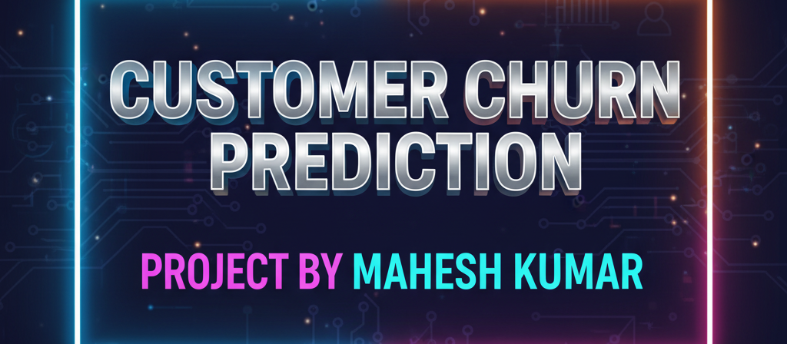
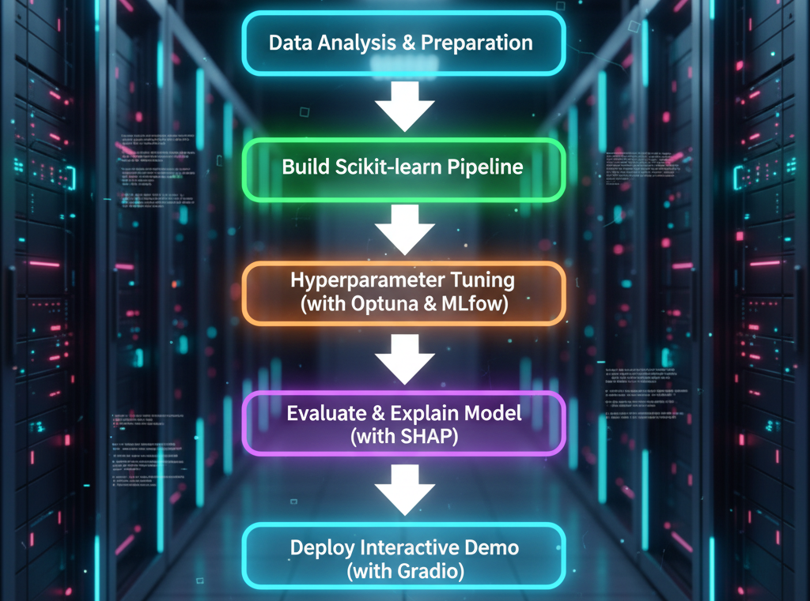
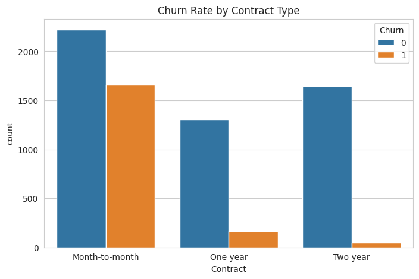
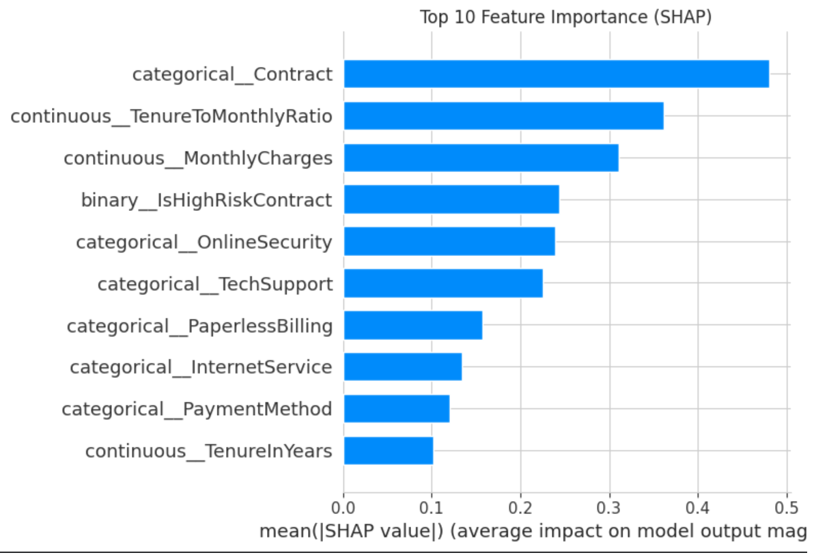
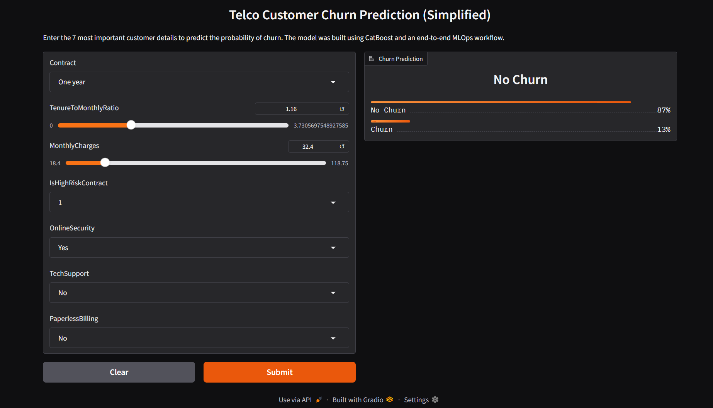

# A Structured Workflow for Churn Prediction
### A Case Study in Building a Reproducible Machine Learning System

**Project Status: Completed**

This repository documents a complete, structured workflow for predicting customer churn in a telecommunications company. It follows a rigorous, version-controlled methodology, moving from raw data to a fully trained, explained, and deployed interactive model.

The project's core philosophy is to demonstrate a professional machine learning lifecycle, emphasizing reproducibility, automation, and maintainability. It culminates in a champion model built with CatBoost, tuned via Optuna, tracked with MLflow, and deployed with Gradio.

---

### Table of Contents
1.  [Key Technologies Used](#-key-technologies-used)
2.  [Project Objective](#-project-objective)
3.  [About the Dataset](#-about-the-dataset)
4.  [The Project Workflow: A Structured Approach](#-the-project-workflow-a-structured-approach)
5.  [Data Analysis & Feature Engineering](#-data-analysis--feature-engineering)
6.  [The Core Pipeline: A Single Source of Truth](#-the-core-pipeline-a-single-source-of-truth)
7.  [Finding the Champion: Automated Tuning](#-finding-the-champion-automated-tuning)
8.  [Final Model Performance: The Moment of Truth](#-final-model-performance-the-moment-of-truth)
9.  [Model Explainability: Unlocking the Black Box](#-model-explainability-unlocking-the-black-box)
10. [Interactive Demo with Gradio](#-interactive-demo-with-gradio)
11. [How to Use This Repository](#-how-to-use-this-repository)
12. [Future Work: The Path to True Production](#-future-work-the-path-to-true-production)

---

### 🛠️ Key Technologies Used
- **Data Analysis:** `Pandas`, `NumPy`, `ydata-profiling`
- **Modeling:** `Scikit-learn`, `CatBoost`
- **Experiment Tracking:** `MLflow`
- **Hyperparameter Tuning:** `Optuna`
- **Model Explainability:** `SHAP`
- **Interactive Demo:** `Gradio`
- **Version Control:** `Git` & `GitHub`

---

### 🚩 Project Objective

The primary objective was to build a robust and reliable machine learning system to predict customer churn. This involved two parallel goals:

1.  **Business Goal:** To accurately identify customers at high risk of leaving, enabling the business to take targeted retention actions and reduce revenue loss.
2.  **Technical Goal:** To implement a professional, structured workflow, demonstrating best practices for version control, automated data analysis, feature engineering, pipelining, experiment tracking, hyperparameter tuning, and model deployment.

---

### 💾 About the Dataset

This project uses the **Telco Customer Churn** dataset, a popular dataset for classification tasks. It contains information about 7,043 customers from a fictional telecommunications company.

- **Features:** The data includes customer account information, demographic details, and the services they have signed up for (e.g., `PhoneService`, `InternetService`, `TechSupport`).
- **Target Variable:** The target variable is `Churn`, a binary indicator of whether the customer left the company within the last month.
- **Challenge:** The dataset presents a realistic class imbalance, with approximately 26.5% of customers having churned. This makes it a good test case for building a model that performs well on an unequal distribution.

---

### ⚙️ The Project Workflow: A Structured Approach

This project was built on a structured, iterative lifecycle. Every step was version-controlled with Git using Conventional Commits to ensure a clean and understandable project history. The entire process is captured in the diagram below.



---

### 📊 Data Analysis & Feature Engineering

The project began with a deep dive into the dataset. An automated `ydata-profiling` report revealed key characteristics and relationships. A key finding from the EDA was the strong correlation between contract type and churn, as shown below.



Based on this analysis, a series of new features were engineered to capture complex customer behaviors. The most impactful of these were:
*   `TenureToMonthlyRatio`: A powerful feature capturing the relationship between customer loyalty and monthly cost.
*   `IsHighRiskContract`: A binary flag identifying customers on short-term contracts with high monthly bills.

---

### ⛓️ The Core Pipeline: A Single Source of Truth

The heart of this project is a single, robust `scikit-learn` pipeline. This object encapsulates the entire workflow, from raw data to final prediction, preventing data leakage and ensuring perfect reproducibility.

**Pipeline Architecture:**
*   **Continuous Features:** Imputed with the median and scaled with `StandardScaler`.
*   **Categorical Features:** Imputed with a constant and then encoded with `OrdinalEncoder`, optimized for CatBoost's internal handling.
*   **Binary Features:** Passed through without modification.
*   **Feature Selection:** A `SelectKBest` step was included to allow the model to choose only the most impactful features.
*   **Estimator:** The final step is the `CatBoostClassifier`.

---

### 🏆 Finding the Champion: Automated Tuning

Instead of manual tuning, this project used a state-of-the-art, automated approach.

*   **Optuna:** Ran an intelligent search across 50 trials to find the optimal combination of hyperparameters, including the number of features to select, tree depth, learning rate, and regularization.
*   **MLflow:** Every single trial was logged as a nested run, creating a complete and auditable history. The champion model's parameters and score were promoted to a parent run for easy access in the MLflow Model Registry.

---

### 🎯 Final Model Performance: The Moment of Truth

The champion model was evaluated on the completely unseen test set. The results confirm that the model is both accurate and reliable.

| Metric         | Test Set Score |
| :------------- | :------------- |
| **AUC-ROC**    | **0.8441**     |
| F1-Score       | 0.5732         |
| Recall         | 0.5080         |
| Precision      | 0.6574         |
| Accuracy       | 0.7991         |

The test AUC of **0.8441** is extremely close to the validation AUC of **0.8428**, proving that our model generalizes exceptionally well and is not overfit. The confusion matrix below provides a visual summary of its performance on the 1,409 customers in the test set.


---

### 🧠 Model Explainability: Unlocking the Black Box

A model is only useful if we can trust and understand it. **SHAP (SHapley Additive exPlanations)** was used to explain the predictions of our champion model. The plot below shows the top 10 features that have the most impact on the model's output.



**Key Drivers of Churn:**
1.  **Contract:** Month-to-month contracts are the single biggest predictor of churn.
2.  **TenureToMonthlyRatio:** Our engineered feature proved to be the second most powerful signal.
3.  **MonthlyCharges:** High monthly bills strongly correlate with a higher churn probability.

---

### 🚀 Interactive Demo with Gradio

To make the model accessible to non-technical stakeholders, a simple web application was built using Gradio. The interface focuses on the top 7 most impactful features identified by SHAP, providing a clean and user-friendly experience.



---

### 📖 How to Use This Repository

1.  **Clone the repository:**
    ```
    git clone https://github.com/munnurumahesh03-coder/Customer-Churn-Prediction.git
    cd Customer-Churn-Prediction
    ```
2.  **Install dependencies:**
    The project is contained within the `Churn_Prediction_MLOps.ipynb` notebook. All dependencies are installed via `pip` commands within the notebook.

3.  **Run the Notebook:**
    Open the notebook in Google Colab or a local Jupyter environment and run the cells sequentially. The MLflow experiments will be logged to a local `mlruns` directory.

4.  **Launch the Interactive Demo:**
    Running the final cells will launch the Gradio web application and provide a public URL for live testing.

---

### 🔮 Future Work: The Path to True Production

This project provides a solid foundation. The next steps in a true production environment would involve:

*   **Drift Detection:** Implement automated monitoring for **data drift** and **concept drift** using libraries like **Evidently AI** or **NannyML**.
*   **Automated Retraining:** Build a CI/CD pipeline (e.g., using GitHub Actions ) that can automatically trigger model retraining when drift is detected or on a regular schedule.
*   **REST API Deployment:** Containerize the model and deploy it as a scalable REST API endpoint on a cloud service like AWS, GCP, or Azure.

